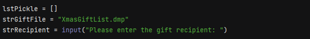
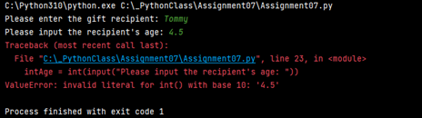
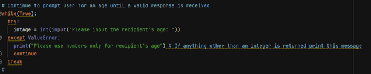
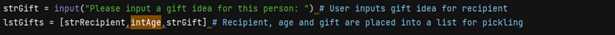
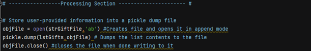
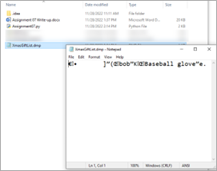
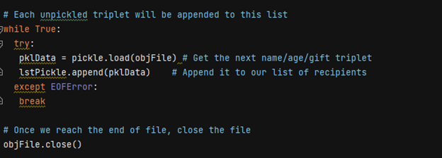
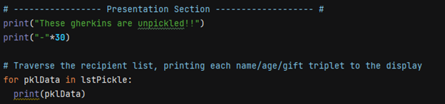
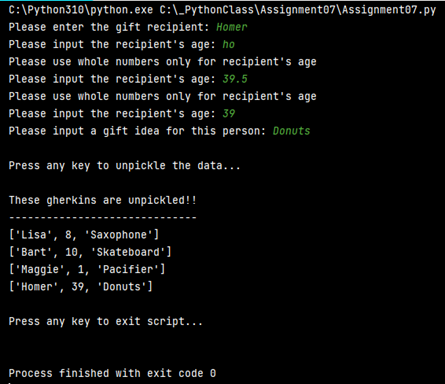
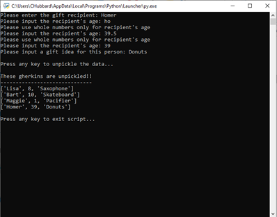

Carol Hubbard \
November 27, 2022 \
Foundations Of Programming: Python \
Assignment 07 \
GitHub URL: https://github.com/CarolHubbard/IntroToProg-Python-Mod07

# Pickling Demo with Structured Error Handling

## Introduction
In this module we discussed pickling and structured error handling. In Python, pickle is primarily used in serializing and deserializing a Python object structure. In other words, it’s the process of converting a Python object into a byte stream to store it in a file/database, maintain program state across sessions, or transport data over the network.1  

In Python, structured error handling provides a way to intercept and handle exceptions gracefully so that your program does not crash or present the user with a confusing error message.

In this assignment we were to research pickling and structured error handling and then create our own demo which incorporated both concepts.

## Demo Script
I chose a basic Christmas gift list to demonstrate pickling. In this demo, the user is prompted to enter the name of a gift recipient, the recipient’s age, and a suggested gift for this person. That data is then placed into a list which is pickled into “XmasGiftList.dmp”.

After the data has been pickled, the script pauses so the user can verify that the XmasGiftList.dmp file has indeed been created. After verification, they press any key to continue the script which unpickles the data and displays it to the user. Let’s go through each section in detail.

### The Data Section
This section begins by importing the Pickle module. This is needed in order to utilize the dump and load methods which will save and retrieve the data respectively.
 
 \
Listing 1. Import the pickle module into the script

Next, we set our variables and prompt the user for the name of a gift recipient.

\
Listing 2. \
Next, the user is prompted to enter the recipient’s age. This must be an integer. If anything other than an integer is entered (i.e float, letters) an error is returned. 

 \
Figure 1. ValueError with no structured error handling

This is where we get our feet wet with structured error handling. The end user most likely won’t have any idea what “invalid literal for int() with base 10:” means. So we need to come up with a user-friendly error in the event the script encountrers any. We use a try-except block to achieve this. Here we are specifically looking for ValueErrors. The Python ValueError is raised when an operation or function receives an argument that has the right type but an inappropriate value.2

\
 Listing 3. Try-except error handling block 

Now when a ValueError is encountered, Python will return the user-friendly error “Please use whole numbers only for recipient’s age.”
A while loop will continue to prompt the user for a valid age value until it receives one. The loop stops once this is done.
Once the age has been provided then the script prompts for a suggested gift. At which point, the recipient, recipient’s age and suggested gift are all added to the list, lstGifts. This list is what gets pickled.

\
Listing 4. User input stored in list for pickling

### The Processing Section
This is really where the magic happens. The dump file is created (if it doesn’t already exist) and opened in append mode. Then the contents of the list are dumped into it and the file is closed.

\
Listing 5. Data is pickled into dump file
 
Because the file is being opened in append mode, each time a new recipient and gift is added, a new list item is being added to the dump file rather than overwriting the existing contents.

At this point the script will pause so that the user can check to see that the XmasGiftList.dmp file exists and see that the contents are in binary.
 
\
Figure 2.  Dump file contents in binary

When the script continues, XmasGiftList.dmp is opened in read-only mode. The contents of the dump file are looped through and placed into the empty list, lstPickle. We use another try-except block to prevent any errors once the end of the file has been reached. The while loop will continue running through the items in the dump file and placing the lists items into lstPickle. Essentially creating a new list of lists. When there are no more items in the file it will break out of the loop and close the file.

\  
Listing 6.  Data is unpickled from dump file

### The Display Section
Finally, we want to display the pickled items back to the user in their original form which is a list. To do that, we use a for loop to loop through each list item in lstPickle and then print those items to the user.

\
Listing 7. Unpickled data is displayed to user

## See it in Action
Here I run the script in PyCharm. You can see when I try entering either text or decimals for Homer’s age an error is generated. However, because it’s a custom error we created, the user will be able to understand where the issue is. 
After entering Homer’s age and a perfect gift recommendation of donuts, the script continues on to unpickle any existing entries in the dump file and display them.

\
Figure 3. Script run in PyCharm

Here the script is run in a command window.

\
Figure 4. Script run in command window

## Summary
This script demonstrated the use of the Pickle function to store and retrieve complex data in binary format. We also took a look at structured error handling which allows you to gracefully handle errors when they arise. The is done through either custom error messages or breaking out of a loop when an error state is reached.

## Researching Pickling
For pickling, I found these URLs to be extremely useful:
 
https://sites.pitt.edu/~naraehan/python3/pickling.html
 
https://subscription.packtpub.com/book/application-development/9781787288386/9/ch09lvl1sec58/pickling
 
https://subscription.packtpub.com/book/application-development/9781787288386/9/ch09lvl1sec59/unpickling
 
All three sites provided examples which were enormously helpful in understanding the concepts. The example given on the first URL is heavily commented so you know exactly what is being done and why during the pickling process.

## Researching Structured Error Handling
Both of these sites were great for getting a better understanding of how to use error handling in Python. Both give lots of details and clear explanations with examples for each type of error.
 
[This is a link](https://www.datacamp.com/tutorial/exception-handling-python)
 
https://realpython.com/python-exceptions/

## References
1.	https://www.synopsys.com/blogs/software-security/python-pickling/#:~:text=Pickle%20in%20Python%20is%20primarily,transport%20data%20over%20the%20network
2.	https://docs.python.org/3/library/exceptions.html
